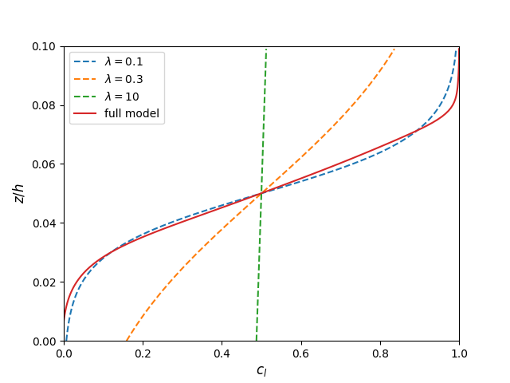

<h2 style="color:purple;font-size: 2em;">Overview</h2>

##### Understand the granular segregation and the transport equation
  - [[1] General Model For Segregation Forces in Flowing Granular Mixtures](https://arxiv.org/pdf/2309.13273.pdf)
  - [[2] Diffusion, mixing, and segregation in confined granular flows](https://arxiv.org/pdf/1809.08089.pdf)
  - [[3] On Mixing and Segregation: From Fluids and Maps to Granular Solids and Advection–Diffusion Systems](https://pubs.acs.org/doi/10.1021/acs.iecr.5b01268)

##### PINN implementation
  - [https://github.com/nanditadoloi/PINN](https://github.com/nanditadoloi/PINN)
  - [https://github.com/omniscientoctopus/Physics-Informed-Neural-Networks](https://github.com/omniscientoctopus/Physics-Informed-Neural-Networks)
  - [https://github.com/maziarraissi/PINNs](https://github.com/maziarraissi/PINNs)

<h2 style="color:purple;font-size: 2em;">1. Introduction</h2>
<!--  -->

An advection-diffusion transport equation has been successfully used to model the segregation. 
Within this continuum framework, the concentration of species $i$ can be expressed as 

$$\frac{\partial c_i}{\partial t} + {\nabla \cdot (\pmb u c_i)}={\nabla \cdot (D\nabla c_i)}.$$

With assumption of incompressible flow and negligible vertical acceleration, the above equation in the $z$ direction can be written as

$$\frac{\partial c_i}{\partial t} +\frac{\partial  (w+w_{i})c_i}{\partial z}=\frac{\partial}{\partial z} \Big( D\frac{\partial c_i}{\partial z} \Big),$$

or, rearranging, as

$$ w_{i}c_i-D\frac{\partial c_i}{\partial z}=0, $$

where $w_{i}$ is the segregation velocity relative to the bulk velocity $w$.

| | | full model | simplified model |
|--------|---------------------- | ---------------------- | ---------------------- |
|intruder scaled segregation force|$$F_{i,0}$$ |  $$-f^g(R)\frac{\partial{p}}{\partial{z}}V_i+f^k(R)\frac{p}{\dot\gamma}\frac{\partial\dot\gamma}{\partial{z}}V_i  $$ |   |
|Mixture scaled segregation force |$$\hat F_{l}$$   $$\hat{F}_{s}$$ |  $$(\hat{F}_{l,0}-\cos{\theta})\textrm{tanh}\Big( \frac{\cos{\theta}-\hat{F}_{s,0}}{\hat{F}_{l,0}-\cos{\theta}}\frac{c_s}{c_l} \Big)$$     $$-(\hat{F}_{l,0}-\cos{\theta}){\frac{c_l}{c_s}}\textrm{tanh}\Big( \frac{\cos{\theta}-\hat{F}_{s,0}}{\hat{F}_{l,0}-\cos{\theta}}\frac{c_s}{c_l} \Big)$$|   |
|effective friction| $$\mu_{eff}$$| $$\mu_s+\frac{\mu_2-\mu_s}{I_c/I+1}$$|
|viscosity| $$\eta$$| $$\mu_{eff} \frac{P}{\dot\gamma}$$|
|drag coefficient |$$c_{d,l}$$   $$c_{d,s}$$  |  $$[k_1-k_2\exp(-k_3 R)]+s_1 I R +s_2 I (R_\rho-1)$$    $$c_{d,l}/R^2$$|   |
|segregation velocity |$$w_l$$   $$w_s$$ | $$\frac{ \hat F_{l} m_l g_0}{c_{d,l} \pi \eta d_l}$$     $$-\frac{ \hat F_s m_s g_0}{c_{d,s} \pi \eta d_s}$$|    $$0.26 d_s \ln R \dot\gamma (1-c_i)$$ |
|diffusion coefficient|$$D$$ | $$0.042 \dot \gamma (c_ld_l+c_sd_s)^2$$                   |    $$0.042 \dot \gamma {\bar d}^2$$  |

The full model prediction is compared to the previous model by Schlick et al. 2015 with different values of $\lambda$.

$$\frac{d_c}{d_z}=\frac{1}{\lambda}c_l(1-c_l)$$

